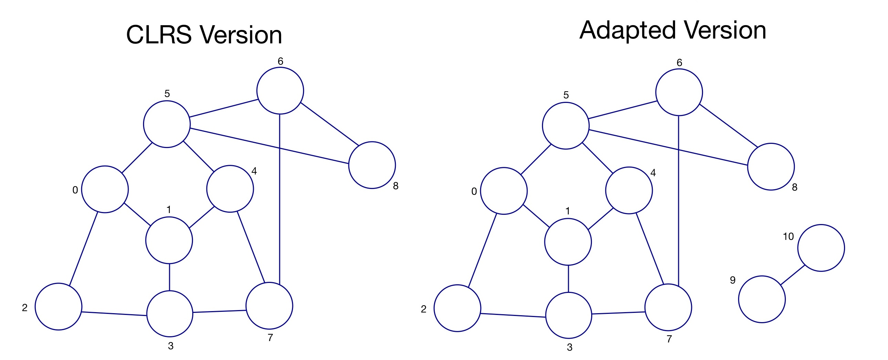

# Adjacency-Matrix

This program implements a breadth-first search algorithm on a graph to find its connected components and a corresponding 'spanning forest' (a forest comprised of a spanning tree for each connected component). 

The program comprises a solution to Challenge 7 of *Gustedt, J. (2019). Modern C. Manning Publications.*


## Challenge Posed


*"The adjacency matrix of a graph G is a matrix A that holds a value true or false in element A[i][j] if there is an arc from node i to node j.*

*At this point, can you use an adjacency matrix to conduct a breadth-first search in a graph G? Can you find connected components? Can you find a spanning tree?"*

## Background

For the program, I have defined a graph (in source file *main.c*) via an Adjacency Matrix and I have used this as the graph on which to conduct Breadth-First search.

The graph used is an adapted version of a connected graph taken from P557 of *Cormen, T.H., Leiserson, C.E., Rivest, R.L., & Stein, C. (2022). Introduction to Algorithms (4th ed.). MIT Press.* (or *CLRS* as it is informally known).

The adaptation was to add another component (two further vertices which are connected to eachother but not to the other vertices). Please see below for a comparison of of original graph ('CLRS' version) and the graph used for this program ('Adapted version'):



Like CLRS, the search here is conducted with vertex 1 as the original source vertex for the first connected component.

## Description of Implementation

The main drivers of this program are the two functions:
- *explore_tree*
- *explore_graph*

*explore_tree is a recursive function which 'explores' the vertex at the start of the queue. The function checks whether the vertices adjacent to those at the start of the queue have either (i) been added to the queue already (therefore have colour grey ('g')) (ii) have already been explored (i.e. the explore tree function has been called with that vertex at the front of the queue) in which case the vertex has colour black, or (iii) the vertex is a new vertex in which 
case the vertex is added to the end of the queue and the connecting edge is added to the spanning forest graph.

This function also calculates the distances each vertex in a conncected is from the source vertex. During the algorithm, if the vertices currently being explored are at a distance j, the algorithm is said to be on layer j of the graph (relative to the source vertex). Since when exploring a given layer, we know how many vertices are in that layer (having already explored the layer previously, we know when to increment the layer count in order to track distances correctly)

This function terminates when the queue is empty, meaning the connected component has been found (and we have a spanning tree for it)

*explore_graph* is a recursive function which:
1. Calls functions to set up a new, empty queue starting at the new source vertex and a corresponding new, empty spanning tree to hold the distances 
2. Calls the explore_tree function to explore the connected component of that source vertex and generate a spanning tree from it

Initially, the source vertex is set to 1 (as in CLRS). For each connected component thereafter (if any exist), the source vertex is set to the first vertex in the list of vertex colours that is white (i.e. has been unexplored)

The recursion ends when each vertex is black (i.e. has been explored)

Detailed descriptions of the implementation and the functions involved are included in the source code and header files.

## Output

When run, the executable prints to the console the adjacency matrix of the original graph, the number of connected components and the respective source vertices from which they were explored, and an adjacency matrix corresponding to a spanning forest (spanning tree for each connected component)

## Compilation

- Project uses the custom *Makefile* which: 
    1. Compiles the source code files in sub-directory *src* into object files, and stores them in sub-directory *bin/obj*
    2. Links the object files using the header files in sub-directory *include*, into an executable named *adjacency-matrix* which is stored in sub-directory *bin*

## Usage

1. Navigate to the Challenges/Ch7-Adjacency-Matrix directory

2. To compile run:

    ```bash
    make adjacency-matrix
    ```
    

3. To execute, run:

    ```bash
    ./bin/adjacency-matrix
    ```