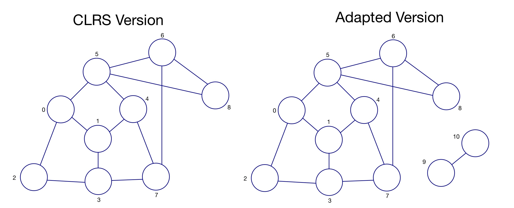

# Shortest Path

This program implements a breadth-first search algorithm on a graph to find the shortest distance between two vertices (supplied by user as command line arguments). The source vertex for the breadth first search is the vertex supplied in the first command line argument. If the vertices are connected, the program will print to the console the shortest distance between these vertices - else will state that the vertices are not connected.

The program comprises a solution to Challenge 8 of *Gustedt, J. (2019). Modern C. Manning Publications.*


## Challenge Posed


*"Extend the idea of an adjacency matrix of a graph G to a distance matrix D that holds the distance when going from point i to point j. Mark the absence of**direct arc with a very large value, such as SIZE_MAX.*
*Can you find the shortest path between two nodes x and y given as an input?"*

## Background

For the program, I have defined a graph (in source file *main.c*) via an Adjacency Matrix and I have used this as the graph on which to conduct Breadth-First search (as done in Challenge 7.)

The graph used is an adapted version of a connected graph taken from P557 of *Cormen, T.H., Leiserson, C.E., Rivest, R.L., & Stein, C. (2022). Introduction to Algorithms (4th ed.). MIT Press.* (or *CLRS* as it is informally known).

The adaptation was to add another component (two further vertices which are connected to eachother but not to the other vertices). Please see below for a comparison of of original graph ('CLRS' version) and the graph used for this program ('Adapted version'):



## Description of Implementation

The main driver of this program is the  functions:
- *explore_tree*

*explore_tree is a recursive function which 'explores' the vertex at the start of the queue. The function checks whether the vertices adjacent to those at the start of the queue have either (i) been added to the queue already (therefore have colour grey ('g')) (ii) have already been explored (i.e. the explore tree function has been called with that vertex at the front of the queue) in which case the vertex has colour black, or (iii) the vertex is a new vertex in which 
case the vertex is added to the end of the queue and the connecting edge is added to the spanning forest graph.

This function also calculates the distances each vertex in a conncected is from the source vertex. During the algorithm, if the vertices currently being explored are at a distance j, the algorithm is said to be on layer j of the graph (relative to the source vertex). Since when exploring a given layer, we know how many vertices are in that layer (having already explored the layer previously, we know when to increment the layer count in order to track distances correctly)

This function terminates when the queue is empty, meaning the connected component has been found (and we have a spanning tree for it)

Detailed descriptions of the implementation and the functions involved are included in the source code and header files.

## Output

When run, the executable prints to the console the the shortest distance between the two vertices, else it states that they are not connected if that is the case.

## Compilation

- Project uses the custom *Makefile* which: 
    1. Compiles the source code files in sub-directory *src* into object files, and stores them in sub-directory *bin/obj*
    2. Links the object files using the header files in sub-directory *include*, into an executable named *shortest-path* which is stored in sub-directory *bin*

## Usage

1. Navigate to the Challenges/Ch7-Adjacency-Matrix directory

2. To compile run:

    ```bash
    make shortest-path
    ```
    

3. To execute, run:

    ```bash
    ./bin/shortest-path n_1 n_2
    ```
    where n_1, n_2 distinct integers between 0 and 10 inclusive